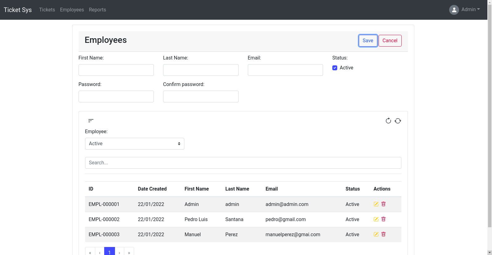

# Ticket System App

**Description:**

It is a basic system in which an employee logs in, can create, update and delete tickets, can create an employee, and then can generate a report to obtain the hours worked.

**Feature:**

- **Login:**

  
    
- **Create a ticket:**

  

- **Create employees:**

- 
    
- **Create Time entries:**

  
    

- **Reports(Worked):**

  
    
- **Technology I use:**

The ticket system uses Vue Framework, Vue JS is a progressive Javascript framework for developing user interfaces. This framework bases its main core on the view layer with the model-view-controller pattern, allowing to relate the presentation layer with the logical layer of the project in an easy and efficient way.

**Installation:**

1. **Clone the repository:**
    
    [`https://github.com/Darknet17/ticket-system-app`](https://github.com/Darknet17/ticket-system-app)
    

 2.  **Execute:** 

```
$ npm install
$ npm run serve
# or run the next command for production
$ npm run build
```

 3.  **Add your file** `.env` **:**

 `cp env.example .env`

 4. **API entry point:**

add your entry point to connect to the api

`VUE_APP_URL_API=http://127.0.0.1:8000/api/v1/`

**Docker:**

Now let's build the Docker image of our application: 

`docker build -t ticket-system-app/dockerize-ticket-system-app .`

Now let's build the Docker image of our application:

`docker run -it -p 80:80/tcp --rm ticket-system-app/dockerize-ticket-system-app:latest`
